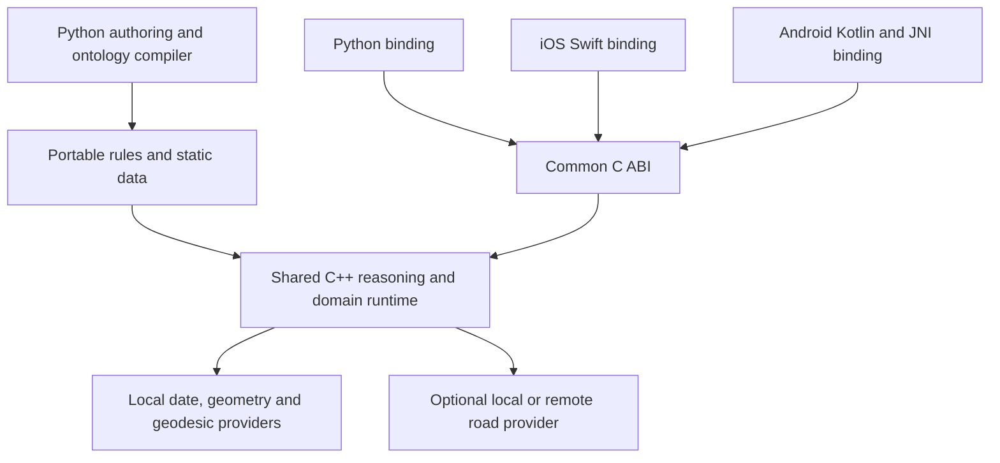

# A shared reasoning runtime for iOS, Android and Python

Refined proposal · 10 September 2026 · mobile execution is a required target

**Make the C++ runtime the portable product, with a stable C interface and thin
platform bindings.** Use `date`/chrono for temporal values, GEOS for geometry,
and a small GeographicLib geodesic component for WGS84 point distances. Make
full PROJ and road routing optional capabilities. Python remains the authoring,
desktop and reference interface; iOS uses Swift/Objective-C and Android uses
Kotlin/JNI. This revises the [earlier library selection](NATIVE_DOMAIN_LIBRARIES.md):
availability of a desktop Python wheel is not evidence of a mobile package.

These are design choices, not an implemented mobile SDK. The existing C++
relation backend compiled for iOS device and simulator in a local probe, but
Python still owns the reasoning loop. A standalone native runtime remains work
to do; the library choices alone do not complete that port.

The [engine extension specification](ENGINE_EXTENSION_SPEC.md) details that
remaining work, with dependency-ordered tasks and Bach/OSM/PROLIX acceptance cases.

## Revised library decisions

| Component | Mobile decision | Availability and remaining work |
| --- | --- | --- |
| Temporal comparisons | **`date` + chrono as the baseline**, behind our C ABI | Small C++17-compatible calendar core. Cross-build the same source for both platforms; add explicit timezone-data packaging only when named zones are needed. |
| ICU/PyICU | Optional rich-calendar capability; remove from the baseline | Existing Python bindings remain useful on desktop. Platform ICU availability is not a portable public C++ `Calendar` API or a pinned data version. Bundle a controlled ICU build if required. |
| GEOS | **Keep for planar geometry and topology** | An iOS dynamic SwiftPM repackaging exists; QField provides downstream mobile build evidence for GEOS/PROJ. Our Android/iOS provider packaging and execution tests are still needed. |
| GeographicLib geodesic core | **Use for the small WGS84-distance feature** | The C implementation can be used from C++ and all three language bindings without the full PROJ dependency/data stack. This is a source-build proposal, not a claim of an upstream mobile SDK. |
| PROJ | Optional when the application needs multiple CRSs or transformations | Mobile build evidence exists through QField. Package the exact database/grids needed; arbitrary offline transformations are not guaranteed by shipping the library alone. |
| Valhalla | **Optional offline regional road provider**, or remote provider | Rallista's third-party `valhalla-mobile` publishes iOS/Android artifacts. Its pinned native version and exposed action set differ from current desktop bindings. |
| OSRM | Primarily an optional server provider for this design | Current official desktop C++/Python access is verified; a maintained equivalent mobile distribution was not established. |
| Lanelet2 | Map preparation/server analysis initially | No maintained mobile package established. Export lane/sign relations for local reasoning; a full on-device port needs separate work. |

Evidence and version details: [temporal candidates](research/temporal-library-candidates.md),
[mobile spatial candidates](research/mobile-spatial-candidates.md),
[road candidates](research/road-library-candidates.md).

The minimal GeographicLib choice supports ellipsoidal point distances and related
geodesic operations; it does not replace GEOS topology, PROJ CRS transformations,
or network routing. Use the same selected source revision for Python and mobile
through our provider. Python's independent `geographiclib` implementation would
not by itself satisfy the shared-native-code requirement.
[GeographicLib C source](https://github.com/geographiclib/geographiclib-c)

If PROJ is enabled alongside the small geodesic feature, select one geodesic
implementation/revision for the provider. Avoid unintentionally linking two
public `geod_*` implementations from PROJ and standalone GeographicLib; use PROJ's
copy or explicitly isolate the standalone symbols, then verify the same contract.

## Bindings and distribution

| Caller | Proposed binding | Distributed artifact |
| --- | --- | --- |
| Python desktop/server | Existing-style `ctypes` over the common C ABI; prebuilt binaries preferred | Platform Python wheel with matching native provider binaries |
| Native C++ | Direct use of the same C ABI or private C++ implementation | Native library and public C header |
| iPhone/iPad | Small Swift wrapper importing a C module; Objective-C++ only where useful | XCFramework with separate device and simulator variants; Swift Package integration |
| Android | Small Kotlin/Java API calling JNI, which calls the common C ABI | AAR with per-ABI native libraries; optional Prefab package for C++ consumers |

Swift already imports C APIs; choosing a C boundary avoids exposing STL types and
C++ ownership rules in every binding. Apple supports static libraries in
XCFrameworks; dynamically linked iOS distribution instead uses framework bundles,
not the desktop `.dylib` layout. Android supports native C++ through the NDK and
JNI. Minimize transitions and copied data by submitting batches and returning
bounded result pages.
[Swift interoperability](https://www.swift.org/documentation/cxx-interop/),
[Apple XCFrameworks](https://developer.apple.com/documentation/xcode/creating-a-multi-platform-binary-framework-bundle),
[Android CMake](https://developer.android.com/ndk/guides/cmake),
[JNI guidance](https://developer.android.com/ndk/guides/jni-tips)

GEOS adds an LGPL packaging constraint: its inspected iOS package deliberately
uses dynamic linking. A static GEOS distribution needs an appropriate relinking
and source-distribution route; the core's static XCFramework probe does not
resolve that. If permissive static dependencies are required, evaluate
Boost.Geometry for a declared subset instead of assuming GEOS equivalence.
[GEOS packaging and alternatives](research/mobile-spatial-candidates.md#geos-packaging-and-the-permissive-alternative)

Ship precompiled machine code in the mobile app. The current
[`build_native`](../src/dlp_reasoner/native.py) compiles sources into a desktop
cache at first use; that is not the mobile loader/build strategy. Build all
native dependencies with the target toolchain, compatible C++ runtime settings
and tested deployment targets. Android builds must account for 16 KB pages in
native code, prebuilt dependencies and packaging. Start with arm64 devices and
the emulator/simulator architectures needed by CI; do not equate Linux arm64
Python wheels with Android binaries.
[Android C++ runtime](https://developer.android.com/ndk/guides/cpp-support),
[Android ABIs](https://developer.android.com/ndk/guides/abis),
[16 KB support](https://developer.android.com/guide/practices/page-sizes)

Use opaque owning handles, fixed-width typed values and explicit byte lengths.
Keep geometries, indexes, term tables and graphs in native memory. Catch C++
exceptions before crossing C/JNI boundaries, distinguish failed evaluation from
false, and define cancellation and buffer lifetimes. Never share a raw geometry
pointer between two independently loaded GEOS copies. Declare temporal precision,
CRS/axis order, units and distance model in the operation contract.

## The engine work that mobile requires

The current [`native_store.h`](../src/dlp_reasoner/native_store.h) exposes stores
and joins over opaque term IDs. It is not a complete reasoner API. Python in
[`engine.py`](../src/dlp_reasoner/engine.py) owns fixed-point scheduling, equality
and congruence, witnesses, constraints, limits and incremental maintenance.
[`reasoner.py`](../src/dlp_reasoner/reasoner.py) and
[`compiler.py`](../src/dlp_reasoner/compiler.py) also provide RDF term handling,
ontology compilation, query semantics and cache management.

The rarely changing ontology makes a split practical:

1. **Compile the ontology and rule plans ahead of time** on desktop/server.
   Define a portable, versioned package containing typed term dictionaries, rules,
   static data, semantic profile and provider/data requirements. This serializer
   and loader are new work; do not serialize Python objects, pointers or hash-table
   memory layouts. Retain enough information for the promised query/profile APIs.
2. **Run the reasoning/query runtime locally in C++.** Start with loaded static
   consequences plus bound temporal/spatial query operations. This first stage is
   explicitly read-only; it does not establish dynamic rule maintenance.
3. **Port the semantic loop and update machinery for live observations.** Preserve
   equality, existential witnesses, constraints, completeness/limits and insertion,
   deletion and rule-update behavior for each declared supported profile. Add
   event-time windows, late-event and expiration handling under the separate
   temporal proposal. Unsupported features must be rejected explicitly.
4. **Keep desktop Python as the conformance reference.** The Python relation path
   and native/mobile paths consume the same domain contracts. A native parser can
   follow if phones must author arbitrary ontologies themselves; it is not needed
   merely to execute precompiled rules offline.

Embedding CPython is a possible interim route to retain the current Python
semantic engine, but it brings an interpreter and platform-specific extension
packaging. It does not make ordinary PyICU/Shapely/pyproj wheels usable on phones.
It also requires replacing the on-demand native compiler path. Prefer a native
runtime for the intended query-focused mobile product; the
[temporal/binding review](research/temporal-library-candidates.md) records the
official Python mobile embedding support and limitations.

## Offline road data and external systems

The verified **Rallista `valhalla-mobile` 0.6.3** distribution contains an iOS
XCFramework and an Android AAR. Its declared minimums are iOS 16.4 and Android
API 24; these would constrain the optional routing feature. It supports routes,
trace matching, elevation and source-to-target matrices, while `isochrone`,
`locate` and optimized-route wrappers are absent. It uses **Valhalla 3.6.3**, not
the previously examined desktop 3.8.3. Treat this as a concrete integration
candidate from a downstream maintainer, with explicit feature/version gates.
[Mobile project](https://github.com/Rallista/valhalla-mobile),
[inspected release](https://github.com/Rallista/valhalla-mobile/releases/tag/0.6.3)

For shared results, pin the native revision, graph build, costing options and
wrapper behavior across platforms, or distinguish provider versions in results
and caches. The AAR is a Kotlin/JNI package, not a ready Prefab C++ dependency.
We can use its host APIs through the provider contract for a prototype; direct
C++ integration requires adopting the native build and exposing our boundary.
Avoid loading a second graph merely to serve another binding.

Build graph tiles and lane/sign mappings away from the phone and distribute
versioned regional data packs. Include route boundaries and out-of-region
statuses: truncating a graph can omit a valid path that leaves and re-enters the
region. Preserve the distinction between shortest distance and the distance of
the selected fastest/cost-optimal route. Map changes invalidate edge IDs and
cached routes according to the provider manifest.

The local engine should still answer temporal/geometry queries without network
access. Configure remote routing/GIS as an optional capability; an unavailable
remote provider produces an unavailable/incomplete result, not an invented local
distance. A map renderer supplies display data, not necessarily the routable
graph, traffic rules or geometry semantics required by the engine.

## Queries, streams and mobile resource limits

Keep a native context alive across foreground queries, with immutable ontology
and static-map state plus a bounded mutable observation window. Cache decoded
values, geometry indexes and selected road tiles; place explicit byte/entry
budgets on these caches. Cache results by ontology, map, provider, timezone/CRS
data and traffic revisions as applicable. Wall-clock buckets may change temporal
answers, so approximate reuse requires an explicitly approximate operation.

Run queries off the UI thread and serialize all operations on each native context
through one worker/actor, including queries, mutations and destruction, matching
the current native handle contract. Batch observations and queries; support deadlines
and cancellation. On pause or memory pressure, evict rebuildable caches and save
enough state for deterministic replay. For deletions, retain required proof/input
state or rebuild from authoritative data; a closure snapshot alone is insufficient.

Mobile apps cannot assume indefinite background execution. Persist stream offsets,
watermarks and the observation log as required, then resume under a declared
late-event policy. Continuous monitoring needs an appropriate platform execution
mode; it does not follow from linking a native library.
[iOS background execution](https://developer.apple.com/documentation/uikit/extending-your-app-s-background-execution-time),
[Android process lifecycle](https://developer.android.com/guide/components/activities/process-lifecycle)

## Validation and implementation order

The [local portability probe](research/mobile-build-probe.md) compiled the existing
C++17 relation backend for iOS device and simulator and packaged an XCFramework.
It did not link/run an app or build the proposed domain libraries. No Android NDK
was found in the inspected SDK locations, so Android compilation was not tested.
No mobile SDKs or production dependencies were installed for this refinement.

The implementation acceptance sequence should be:

1. Reproducible iOS/Android native builds plus real execution of relation and
   domain-library fixtures through Swift and JNI, including arm64 and 16 KB Android.
2. Portable package loading and static query parity with Python, checked for term
   identity, equality aliases, unsupported profiles and complete/incomplete results.
3. Native incremental runtime and temporal-window parity, with inserts, retractions,
   late events, cache invalidation, cancellation and suspend/resume replay.
4. Optional regional routing parity on tiny checked networks, then measured
   cold/warm latency, resident memory, app/data size, energy and prolonged stream
   operation on physical devices. Test disconnected and out-of-region cases.

Keep library builds distinct from conformance and performance evidence. No
mobile speed, memory or battery advantage has been measured by this research.
