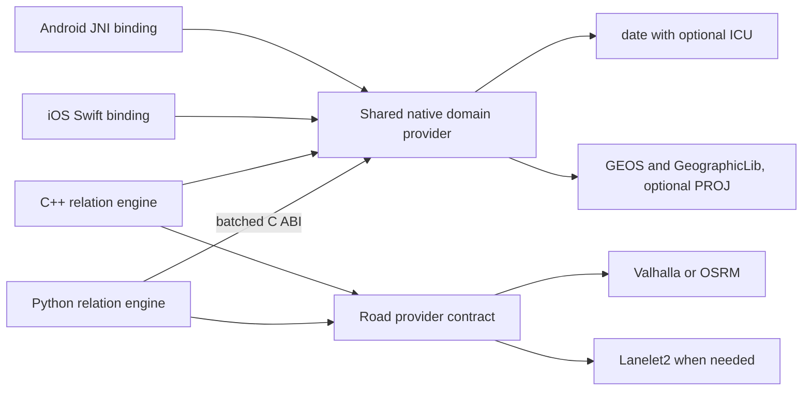

# Shared temporal, geometry and road-network libraries

Library selection · checked 10 September 2026 · proposed engine integration

**Refined for iPhone and Android:** use a shared C++ runtime with a C interface,
called by Python, Swift/Objective-C and Kotlin/JNI. Select `date`/chrono as the
temporal baseline, GEOS for geometry and the small GeographicLib geodesic core
for WGS84 point distances. Make full PROJ and road routing optional capabilities.
ICU/PyICU remains an existing-binding option for richer calendar requirements;
desktop Python packages are not the mobile deployment strategy. The
[mobile runtime proposal](MOBILE_RUNTIME_PROPOSAL.md) records concrete mobile
packages, build evidence and the remaining port of Python-owned reasoning logic.
These choices complement the [external-provider design](EXTERNAL_PROVIDERS.md).

## Concrete choices

| Need | Native implementation/API | Python access | Recommendation for this engine |
| --- | --- | --- | --- |
| Lightweight exact temporal kernel | Howard Hinnant `date` + C++ `<chrono>` | A project-owned C ABI through `ctypes`, still to implement | Baseline for desktop and mobile; cross-build the same source and add Swift/JNI wrappers. |
| Rich calendars with existing Python bindings | ICU4C `Calendar::before`, `after`, `equals` | PyICU directly calls ICU C++ | Optional. Mobile system ICU is not a portable public C++ dependency; use an app-owned build when needed. |
| Geometry distance and topology | GEOS C++ kernel through its stable C API | Shapely, or our common provider ABI | Keep. iOS packaging and downstream Android build evidence exist; qualify our exact mobile builds. |
| Small WGS84 geodesic capability | GeographicLib C geodesic routines, callable by C++ | Our common provider ABI, still to implement | Mobile baseline for point distances; avoids requiring all of PROJ. |
| CRS conversion and extended GIS | PROJ C API | pyproj `Transformer` and `Geod`, or our ABI | Optional on mobile with selected database/grids; no arbitrary offline CRS guarantee. |
| Routes, road distance, travel time, map matching | Valhalla C++ `valhalla::tyr::actor_t` | Official `pyvalhalla`, imported as `valhalla` | Optional offline regional provider using a qualified mobile build; third-party Valhalla Mobile packages exist. |
| Lane connectivity and sign applicability | Lanelet2 routing, matching and traffic-rule modules | Official `lanelet2` | Initially prepare lane/sign relations off-device; no maintained mobile package established. |
| Alternative road router | OSRM C++ `osrm::OSRM` | Official `osrm-bindings`, imported as `osrm` | Server option initially; maintained mobile packaging remains unverified. |

Primary API evidence: [ICU Calendar](https://unicode-org.github.io/icu-docs/apidoc/released/icu4c/classicu_1_1Calendar.html),
[PyICU](https://pypi.org/project/pyicu/),
[`date`](https://github.com/HowardHinnant/date),
[GEOS C API](https://libgeos.org/usage/c_api/),
[Shapely](https://shapely.readthedocs.io/en/stable/),
[PROJ geodesics](https://proj.org/en/stable/geodesic.html),
[pyproj Geod](https://pyproj4.github.io/pyproj/stable/api/geod.html),
[Valhalla Actor](https://valhalla.github.io/valhalla/bindings/python/api/actor/),
[Lanelet2](https://github.com/fzi-forschungszentrum-informatik/Lanelet2),
[OSRM Python bindings](https://raw.githubusercontent.com/Project-OSRM/osrm-backend/v26.9.0/src/python/README.md).
Mobile-specific evidence: [temporal/platform APIs](research/temporal-library-candidates.md),
[geometry and geodesics](research/mobile-spatial-candidates.md),
[routing distributions](research/road-library-candidates.md).
The recommendations are engineering judgments from these interfaces, not measured
performance rankings.

## Temporal: a shared mobile kernel and optional ICU

PyICU's published 2.16.2 source directly invokes ICU's C++ `Calendar::before` and
`Calendar::after`. This meets the requirement for one underlying implementation
in both languages. Set calendar, timezone and Gregorian cutover explicitly;
disable lenient normalization and validate input. ICU calendars use `UDate`, a
floating-point millisecond representation; PyICU converts timestamps at its
boundary from Python seconds. Neither exact microsecond preservation nor a
date-only datatype follows automatically from this API.
[Source inspection and alternatives](research/temporal-library-candidates.md)

This is an existing desktop Python binding, not a ready mobile deployment.
Android's public system ICU explicitly excludes the C++ API; a full shared ICU
calendar implementation would need controlled mobile packaging. For mobile,
prefer `date` unless the richer ICU feature set justifies that work.
[Android ICU availability](https://developer.android.com/guide/topics/resources/internationalization)

For the engine's proposed microsecond profile, `date` is the better fit: it works
with the existing C++17 build and supports calendar dates and chrono time points.
`before(a,b)` becomes checked `a < b`, and `after(a,b)` becomes `a > b`; equality
satisfies neither. The calendar core is header-only; named IANA zones require
the timezone component and a managed database. There is no official Python
binding established by this research: sharing it requires our small wrapper.
[Date API](https://howardhinnant.github.io/date/date.html),
[timezone API](https://howardhinnant.github.io/date/tz.html)

Keep calendar dates, time-of-day, instants and intervals distinct. A time such
as `00:10` needs a date/context to order it against yesterday's `23:50`.
Resolve offsets and DST ambiguity before comparing instants; validate date fields
before conversion. Implement interval relations over the declared endpoint policy.
These libraries do not supply rule windows, watermarks or deletion maintenance.

## Geometry and Earth-surface distance

GEOS supplies the actual spatial predicates needed for geometry rules:
`GEOSDistance_r`, `GEOSDistanceWithin_r`, `GEOSIntersects_r`, `GEOSContains_r` and
`GEOSCovers_r`. Shapely exposes the same kernel as Python functions and vectorized
operations. For example, `(0,0)` and `(30,40)` are distance 50 apart in coordinate
units. Those units are metres only when the chosen coordinate system says so.
GEOS computes in a planar 2D model; longitude/latitude input does not turn this
into metres, and it does not produce road distance.
[GEOS scope](https://libgeos.org/usage/faq/),
[Shapely distance-within](https://shapely.readthedocs.io/en/stable/reference/shapely.dwithin.html)

Use a persistent spatial index to enumerate nearby candidates, followed by exact
predicate evaluation. Shapely's `STRtree.query(..., predicate="dwithin")` supports
this pattern with GEOS 3.10 or later. Its tree is immutable after construction,
which suits rarely changing sign inventories; moving observations should query
the tree rather than cause it to be rebuilt for each event. A scalar distance
function alone does not eliminate a scan of every sign.
[STRtree contract](https://shapely.readthedocs.io/en/stable/strtree.html)

PROJ adds transformations and ellipsoidal geodesics. Its geodesic code derives
from GeographicLib; pyproj's native `Geod` wrapper calls those C routines, so
the two engine paths can reuse the same implementation. Native
`geod_inverse` takes latitude/longitude, whereas `pyproj.Geod.inv` takes
longitude/latitude: normalize this in the adapter. WGS84 distance from `(0°,0°)`
to `(1°E,0°)` is approximately 111,319.49 metres. These point geodesics do not
establish generic geodesic polygon-to-polygon topology.
[PROJ geodesics](https://proj.org/en/stable/geodesic.html),
[pyproj 3.7.2 native binding](https://raw.githubusercontent.com/pyproj4/pyproj/3.7.2/pyproj/_geod.pyx)

For the mobile WGS84-point-distance feature, build the small GeographicLib C
geodesic component directly and expose it through the same provider ABI. Full
PROJ becomes an optional CRS capability with selected databases/grids. Neither
Shapely nor pyproj needs to ship in the mobile app. The
[mobile spatial review](research/mobile-spatial-candidates.md) records iOS GEOS
packaging, Android build evidence and resource/license considerations.
GEOS is LGPL; its inspected iOS package uses dynamic linking. A static mobile
distribution needs an appropriate relinking/source-distribution route, or a
qualified permissive alternative such as Boost.Geometry for the required subset.

## Map and road-network reasoning

Valhalla is the first candidate for routes, matrices, matching vehicle traces,
isochrones and request-specific costing with departure/arrival time. Both its
Python Actor and C++ actor perform native computation; HTTP is optional. Prepare
an OSM-derived graph once and keep the actor/graph resident. Traffic-aware
queries additionally require supplied, versioned traffic data.
[Actor API](https://valhalla.github.io/valhalla/bindings/python/api/actor/),
[graph preparation](https://valhalla.github.io/valhalla/bindings/python/),
[traffic speeds](https://valhalla.github.io/valhalla/concepts/speeds/)

OSRM also now has official in-process Python bindings. Its table distance means
distance **along the fastest route**, not minimum possible road distance.
Valhalla's default route also follows a cost model, and even `shortest=true`
requires attention to hierarchy-pruning settings before promising an optimum.
Expose route distance, duration and optimization objective separately.
[OSRM service semantics](https://raw.githubusercontent.com/Project-OSRM/osrm-backend/v26.9.0/docs/http.md),
[Valhalla costing](https://valhalla.github.io/valhalla/api/route/api-reference/)

For “this sign applies to this vehicle,” add Lanelet2 when lane boundaries,
connectivity and regulatory elements are available. A nearby sign may govern
another carriageway. Lanelet2's default traffic-rule implementation ignores
regulatory elements marked dynamic, so changing closures and signals still
require explicit state and specialized rules.
[Lanelet2 routing](https://raw.githubusercontent.com/fzi-forschungszentrum-informatik/Lanelet2/master/lanelet2_routing/README.md),
[regulatory elements](https://raw.githubusercontent.com/fzi-forschungszentrum-informatik/Lanelet2/master/lanelet2_core/doc/RegulatoryElementTagging.md)

The verified Valhalla 3.8.3 and OSRM 26.9.0 source builds use C++20; keep them
separately packaged from this repository's C++17 relation library. Their inspected
binary wheels require CPython 3.12+, while this repository permits Python 3.11.
The inspected Lanelet2 1.2.3 wheels target Linux x86_64. Exact platform, source-build,
license and dataset constraints are recorded in the
[road-library comparison](research/road-library-candidates.md).

These Python wheels target desktop/server operating systems. For phones,
Rallista's third-party Valhalla Mobile 0.6.3 has verified XCFramework/AAR release
contents, with iOS 16.4 / Android API 24 minimums and an older Valhalla 3.6.3 core.
It is a concrete optional offline-routing candidate, subject to version alignment
and its smaller action set. Keep OSRM server-side and Lanelet2 in map preparation
initially; equivalent maintained mobile packages were not established.
[Mobile routing evidence](research/road-library-candidates.md#mobile-addendum-iphoneios-and-android)

## Sharing memory and optimizing queries

Two bindings to the same library do not automatically share one loaded binary or
one graph allocation. Shapely wheels bundle GEOS and may differ from the system
GEOS used by C++; never pass raw geometry pointers between unrelated owners.
Use WKB plus explicit CRS at boundaries, or have a project-owned provider retain
all native objects and expose handles. For GEOS, prefer its stable C API with
reentrant contexts and explicit ownership.
[Shapely packaging](https://shapely.readthedocs.io/en/stable/installation.html),
[GEOS ownership](https://libgeos.org/usage/c_api/)

For this engine, the recommended integration is one optional shared native
provider for temporal and geometry operations. Python calls a batched C ABI;
C++ calls that same provider directly, iOS imports it through a Swift wrapper,
and Android uses JNI. Road providers can use separately built modules or an
external service under the existing provider contract. A standalone mobile
reasoner additionally needs the semantic runtime currently owned by Python.

Cache decoded dates/geometries by term identity and semantic profile; keep static
spatial indexes, coordinate transformations and road graphs resident. Batch
candidate predicates and routing matrices. Key derived results by ontology,
map, provider, timezone/CRS-data and relevant traffic revisions, plus exact query
inputs and costing options. Geometry proximity, Earth-surface distance and road
distance must remain separately named operations. Preserve provider errors and
unreachable routes as explicit statuses, not zero distance or silent false.

## Local feasibility evidence

A small [reproducible probe](../examples/temporal_geo/library_probe/README.md)
compiled **one C++17 shared library** with `date` v3.0.5, installed GEOS 3.14.1
(C API 1.20.5) and PROJ 9.8.0. A C++ driver and the project's Python 3.12.9
interpreter called the same library and produced identical results for:

- Instant and date ordering, equality, and invalid leap-day rejection.
- Planar point distance 50, with inclusive radius 50 accepted and 49 rejected.
- WGS84 geodesic distance 111,319.49079327357 metres for the equatorial example.

Both compilations passed `-Wall -Wextra -Werror`. This establishes feasibility of
the shared-library boundary; it is not an engine integration, routing benchmark,
timezone/parser conformance test or speedup measurement. ICU, Shapely, pyproj and
road libraries were researched rather than installed/tested in this experiment.
Production engine dependencies and APIs remain unchanged.
