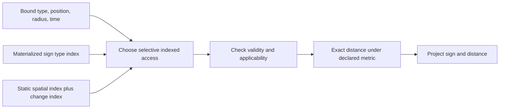
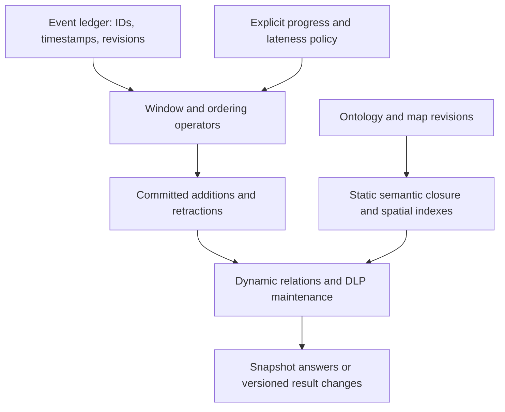

# Temporal and geospatial reasoning beyond thesis DLP

Research and implementation proposal · 10 September 2026

**Recommendation:** retain the DLP semantic core and the persistent C++ relation
backend. Add a typed expression layer, first-class external computation and
relation providers, an optimizer that recognizes indexed spatial access, and an
event-time subsystem that maintains finite, versioned relations. Give static
map queries and live streams equal priority. The largest
likely gains come from avoiding irrelevant candidates, repeated decoding, and
whole-graph updates; a language port alone does not provide those gains.

This document is a design proposal, not an implementation or a performance
claim. The current engine does not execute the proposed predicates or query
syntax. It complements the thesis implementation without changing the meaning
of L0–L3. Research was checked against primary standards, papers, and official
implementation documentation as of the date above. Published findings are cited;
the architecture, contracts, priorities, and benchmark matrix are recommendations
for this repository.

The code baseline inspected is commit `95e957becc61e7ec3cc60197b22fbb4af2821d1a`.
This research adds documentation and standalone fixtures; it does not change
production code, dependencies, or earlier benchmark artifacts.

The accompanying [examples](../examples/temporal_geo/README.md) include synthetic
data, proposed rules, and executable reference checks. Detailed evidence and code
seams are in the [spatial review](research/geospatial-evidence.md),
[temporal review](research/temporal-stream-evidence.md), and
[engine audit](research/engine-extension-audit.md).
The [external provider contract](EXTERNAL_PROVIDERS.md) specifies how rules can
use an existing distance/GIS service, including batching, typed replies,
consistency, failure handling, and recorded observations for volatile services.
The subsequent [mobile runtime proposal](MOBILE_RUNTIME_PROPOSAL.md) refines the
library and binding choices for iOS/Android and identifies the remaining native
semantic runtime work required for standalone mobile execution.
The [engine extension specification](ENGINE_EXTENSION_SPEC.md) now defines the
concrete backlog and worked Bach/OSM/PROLIX acceptance examples. Scoped `MIN` is
part of the first feature slice because the first-child calculation requires it.

## 1. What the engine needs to answer

The motivating query is: “At an explicitly supplied time, find signs of an
inferred type within an inclusive distance of a supplied position.” An ontology
can establish that a particular sign is a stop sign; a spatial index can find
candidate geometries; numeric and temporal operations decide which candidates
qualify. These are complementary responsibilities.

The following is **proposed notation**, not Appendix A DLP or accepted CLI input.
Here `sp:`, `time:`, and `num:` denote project extension namespaces. They do not
claim to be OGC or W3C function names. `unit:metre` is an explicit unit identifier.
The execution context also declares the distance model and dataset snapshot.

```text
query nearby_stop(?s, ?d) given (?position, ?at, ?radius) :-
    ex:StopSign(?s),
    ex:geometry(?s, ?g),
    ex:validDuring(?s, ?interval),
    filter time:contains(?interval, ?at),
    filter sp:dwithin(?g, ?position, ?radius, unit:metre),
    bind sp:distance(?g, ?position, unit:metre) as ?d.
```

In the synthetic projected-coordinate fixture, a 100 m query at 08:30 returns
three stop signs at 10, 50, and 100 m. A speed-limit sign at 60 m is excluded by
type; an expired stop sign at 10 m is excluded by validity. At 09:00 the 100 m
sign expires. The opposite-lane stop sign remains a proximity result: deciding
whether a sign applies to a driver requires additional road and lane semantics.

Do not materialize every `(device, sign, distance)` combination. Reuse sign
classification and geometry indexes, and evaluate position/time as parameters.
For subscriptions, maintain only requested views and emit changes to them.

| Common use case | Required operations | Important interpretation |
| --- | --- | --- |
| Find stop signs within 100 m | Inferred type, indexed radius, distance projection | Inclusive threshold; declared metric and unit |
| Find currently applicable signs | Proximity, validity interval, road/lane/direction joins | Nearness alone is insufficient |
| Find the next sign along a route | Map matching, directed network distance, nearest/top-k | Euclidean nearest is a different query |
| Find hazards near a planned route during a journey | Geometry intersection/distance and interval intersection | Compare both spatial and temporal coverage |
| Detect entry and exit from a geofence | Ordered positions, boundary policy, predecessor state | Late observations can move the transition time |
| Detect a 30-second dwell | Stateful duration/coverage operator | Several inside samples do not prove continuous occupancy |
| Detect observed speeding | Event-time position, applicable speed rule, unit conversion | Use the rule valid at the observation time |
| Find fresh observations | Timestamp order, finite age window | Expiration occurs even without new arrivals |
| Detect missing expected observations | Finalized window, count/absence, coverage declaration | Open-world lack of evidence is not negation |
| Detect conflicting restrictions | Same applicability scope, intersecting validity intervals | Adjacent intervals need not conflict |
| Audit a corrected map or restriction | Valid time and recorded/system time | Distinguish truth claimed for a date from knowledge available then |
| Identify possible nearby signs under GPS uncertainty | Conservative candidates and uncertainty bounds | “Possibly within” differs from “definitely within” |
| Detect crossing between sparse samples | Segment/trajectory model and spatial intersection | Endpoints outside do not exclude an intervening crossing |
| Replay a delayed stream | Event IDs, revisions, event-time ordering, deterministic snapshots | Replay must not depend on the current wall clock |

These cases justify scalar built-ins, indexed access, and stateful operators.
They do not justify putting every operation into a single predicate callback API.

## 2. What the state of the art contributes

| Area | Verified reference/status | Consequence for this design |
| --- | --- | --- |
| RDF geometry interoperability | OGC GeoSPARQL 1.1 is the approved standard listed by OGC; published January 2024 | Reuse geometry vocabulary, literal conventions, and supported function semantics; publish a capability subset [^geo] |
| Indexed distance | PostGIS documents index-assisted `ST_DWithin`; geometry and geography use different metric contracts | Treat radius as an access path with exact refinement, not an obligatory full scan [^postgis] |
| Planar geometry | GEOS explicitly uses a Cartesian model | Pair it with CRS transformation and a separate geodesic implementation where required [^geos] |
| Hierarchical spatial cells | S2 and H3 offer spherical indexing/partitioning facilities with distinct approximation contracts | Use conservative candidates, then verify the requested relation [^s2][^h3] |
| Datatype functions | RIF DTB second edition is a 2013 W3C Recommendation; SWRL is a 2004 Member Submission | Reuse familiar value operations without claiming unrestricted SWRL or RIF conformance [^rif][^swrl] |
| Rule built-ins | RDFox separates tuple atoms, assignments, and filters; Soufflé provides typed functors | Make binding modes, determinism, and value-generation explicit [^rdfox][^souffle] |
| Query expressions | SPARQL 1.1 is the stable Recommendation; SPARQL 1.2 Query is a Working Draft dated 20 August 2026 | Specify comparison and error behavior; do not advertise draft behavior as a settled standard [^sparql11][^sparql12] |
| Temporal vocabulary | OWL-Time has a 2017 Recommendation and a later 2022 Candidate Recommendation Draft | Vocabulary interoperability does not implement event-time execution [^owltime] |
| Temporal rule reasoning | MeTeoR, Temporal Vadalog, and 2026 DRedMTL research address temporal rules and maintenance | Rich temporal recursion requires its own fragment and algorithm [^meteor][^vadalog][^dredmtl] |
| Streams | LARS formalizes stream reasoning; Dataflow/Beam/Flink distinguish event-time progress and window behavior | Make window selection, late data, and answer revision explicit [^lars][^dataflow][^beam][^flink] |
| Incremental computation | Differential dataflow (2013) and DBSP (PVLDB 2023) provide foundations for maintaining changing computations | Learn from signed changes and incremental operators; this is not evidence of a drop-in DLP replacement [^differential][^dbsp] |

GeoSPARQL 1.1 specifies `geof:distance` and `geof:metricDistance`; it does not
define a `geof:dWithin` function. The example's `sp:dwithin` is a custom operation.
An optimizer may recognize an equivalent standard distance-and-comparison
expression, but only when CRS, units, metric, boundary, and error semantics
agree. Likewise, geometric `within` is a topological relation, not a radius test.
[^geo]

Temporal reasoning has advanced beyond simple timestamp filters. MeTeoR combines
approaches to DatalogMTL reasoning. The final Temporal Vadalog journal paper
(online April 2025) describes fragment-aware termination strategies; an older
comparison should not be used to claim the current system lacks them.
The AAAI 2026 DRedMTL paper studies incremental maintenance for bounded programs
and bounded datasets/updates, including periodic representations. These results
do not establish that ordinary DRed in this repository handles temporal recursion.
[^meteor][^vadalog][^dredmtl]

In particular, do not combine temporal operators and L3 existential witnesses
without a separate decidability analysis. Research on temporal existential rules
shows that familiar acyclicity conditions do not transfer unchanged across
temporal semantics. A finite active-window projection is a much smaller initial
commitment than full DatalogMTL or temporal existential reasoning. [^existential]

## 3. Typed built-ins and a separate query language

The current parser reads the thesis's ontology syntax and produces RDF for the
OWL compiler. It is not a generic rule parser. Preserve that interface and add a
separately versioned rule/query language or explicit program API. Arithmetic
surface syntax such as `?distance <= ?radius` should lower to typed expression
nodes; query declarations should lower to a query plan. In the existing model,
`Rule(head=None, ...)` means an integrity constraint, not a query.

The following operator categories are the recommended intermediate representation:

| Category | Binding contract | Evaluation behavior |
| --- | --- | --- |
| Stored relation atom | Enumerates finite tuples and binds matching variables | Uses existing relation indexes and semi-naive deltas |
| Filter | Every operand must already be bound | Retains or rejects a binding; creates no values |
| Bind/assignment | All declared inputs must be bound | Produces one typed result; a bound output is checked for agreement |
| Finite table function | Requires a declared input mode and snapshot | Produces a bounded cursor of output bindings, such as nearby sign IDs |
| Window/temporal/aggregate operator | Requires stream identity, ordering, time and retention policy | Maintains state and emits additions/retractions |

A registry entry should contain the operation IRI and semantic version, type
signatures, valid input/output modes, purity and context dependencies, finite
output guarantees, error policy, cost/cardinality estimates, reference
implementation, and optional native implementation. Reserved operation IRIs must
not silently become stored predicates or asserted facts.

Validation must compute binding availability from finite relations and query
parameters, then activate supported assignment/table modes. Reject unsatisfied
dependencies, wrong arity, unknown functions, and unbound filter operands. An
addition function is not automatically an equation solver. Reordering is legal
only after required inputs are available and the operator's semantics permit it.

Binding safety also does not prove termination. For example, a rule that derives
`N(x+1)` from `N(x)` can generate indefinitely even with every operand bound.
Initially reject value-generating operations in recursive strongly connected
components unless an implemented finite-domain argument applies. Preserve
ordinary positive recursion with pure filters over a finite domain. Limits on
rounds, values, candidates, precision, and provider work must report explicit
incompleteness; they are not proofs of termination. RIF Core and Soufflé both
document the need to consider this distinction. [^rifcore][^souffle]

### Proposed datatype and operation contract

| Family | First supported operations | Representation and boundaries |
| --- | --- | --- |
| Boolean, integer, decimal | Typed comparison; add/subtract/multiply/divide; explicit conversion | Exact integer/decimal operations; specify result types, division precision, and limits |
| Float/double | Explicit approximate numeric operations | Specify NaN/unordered comparisons, infinity, negative zero; do not silently narrow exact numbers |
| Instant | Before/after/equal; add a fixed duration; elapsed duration | Timezone required at ingestion; UTC comparison; declare range, precision, and leap-second policy |
| Fixed duration | Duration arithmetic and comparison | Distinct from calendar months/years |
| Calendar duration/local schedule | Explicit calendar addition and schedule expansion | Later capability; zone identifier, timezone database version, and daylight-saving gap/fold policy |
| Interval | Contains instant; intersects; before; meets; selected Allen relations | Initially half-open `[start,end)`; explicit unbounded endpoints; require `start < end` |
| Geometry | Distance/radius; intersects; contains/covers; explicit transformation | Immutable geometry plus CRS; supported dimensionality and metric are declared |
| Quantity | Compatible-unit conversion and comparison | A number plus a unit/dimension; metres, seconds, and speed cannot be mixed implicitly |

Use XSD value spaces as the datatype reference. `xsd:dateTimeStamp` requires a
timezone; `xsd:dayTimeDuration` and `xsd:yearMonthDuration` are different types.
An unspecified local timestamp must not inherit the server's timezone. Choosing
checked integer microseconds for an initial internal instant representation is
an engineering proposal: accept only a documented range/precision and reject
unsupported values without silent truncation. [^xsd]

Keep RDF lexical/term identity, the engine's OWL equality representatives, and
operation-specific value comparison distinct. Numeric equality must not merge
sign individuals. Topological equality of geometries must not assert
`owl:sameAs`. Existing `EQ` and `NEQ` are not generic numeric comparators.

Use an explicit error contract. For new declared typed/event/geometry input
contracts, reject malformed data at ingestion by default; preserve the baseline
profiles' treatment of opaque RDF literals. Reject invalid signatures during
compilation. A deliberately selected tolerant
mode may turn a data-domain error into a nonmatch with bounded diagnostics; a
failed bind must never produce an unbound head. Provider failure, cancellation,
unsupported CRS, and exhausted resource budgets must fail or mark the query
incomplete, never masquerade as a complete empty answer. SPARQL's FILTER/BIND
error conventions are a useful reference but need an explicit compatibility
mode rather than accidental inheritance. [^sparql11]

## 4. Spatial execution: reduce candidates, then test the metric

Recommended physical plan for the motivating query:



The optimizer may start with a very selective type relation or a very selective
spatial search. It should intersect candidates and push cheap bound filters
before expensive geometry evaluation. Do not require one fixed join order. A
poor cost estimate may slow a plan but must not change its answers.

For static data, build a packed spatial tree once per catalog version. Reuse
parsed geometries, envelopes, transformed representations, and prepared polygons.
For changed sign locations, use a mutable index or an immutable base plus a
small change index and tombstones, periodically rebuilding and atomically
publishing a new generation. A moving query position does not mutate the map.
Use timestamps/interval indexes independently where they are selective; measure
a combined spatiotemporal index before accepting its additional maintenance cost.

The metric contract determines the implementation:

| Data and question | Recommended first implementation |
| --- | --- |
| Local projected points, lines, polygons; distance in that plane | GEOS for geometry operations, with a suitable declared projected CRS |
| Coordinates requiring transformation | PROJ pipeline with explicit source/target CRS and axis convention; pinned transformation data |
| WGS84 point-to-point ellipsoidal distance | GeographicLib, with a conservative spatial candidate search |
| Global shapes under explicitly supported per-function contracts | PostGIS geography provider or separately validated algorithms; specify sphere/spheroid/tolerance for each operation |
| Network distance and lane applicability | A distinct road-network provider and rule vocabulary |

These are recommended responsibilities, not a claim that the libraries are
interchangeable. GEOS does not compute ellipsoidal geometry simply because a WKT
literal contains longitude/latitude. PROJ documents authority axis-order
differences; GeographicLib provides geodesic algorithms. [^geos][^proj][^geographiclib]

PostGIS geography is not one universal exact ellipsoidal contract. Its geography
intersection uses a sphere and a documented tolerance, while geography buffering
uses a selected planar projection and has large-object/date-line caveats.
Expose those differences per function. [^postgisfunctions]

Require finite, nonnegative radii and CRS/unit checks at the boundary. CRS84 conventionally orders longitude
then latitude, while EPSG:4326 authority axes differ. Labelling a coordinate with
another SRID is not transforming it. Planar metres, ellipsoidal surface metres,
three-dimensional distance, and travel distance are separate contracts. A planar
projected result also has projection distortion relative to ground distance.

For the antimeridian, poles, or global searches, use a conservative cover that
cannot omit qualifying candidates. H3 center-based polygon filling is not such
a guarantee for arbitrary intersecting cells. Spherical nearest ordering need
not equal ellipsoidal nearest ordering; checking only the first spherical result
does not establish the exact ellipsoidal nearest. These are reasons to specify
candidate completeness independently from the final predicate. [^h3][^s2]

Declare boundaries and uncertainty. A point on a polygon boundary distinguishes
contains from covers. A sign exactly at the radius matches `<=`. Do not introduce
an undocumented epsilon or round query coordinates to improve cache hits.
For uncertain GPS, offer separate possible/definite predicates using an explicit
uncertainty model. For invalid or unsupported geometry, diagnose the condition
rather than inventing a distance.

Traffic-sign applicability needs more than geometry: lane validity, facing
direction, road position, vehicle class, and possibly route topology. ASAM
OpenDRIVE explicitly models signals with road-relative placement, orientation,
and lane validity. Treat that as a useful interoperability reference rather than
assuming the nearest sign governs the vehicle. [^opendrive]
Distinguish the direction a sign face points from the travel direction to which
it applies. Heading/bearing operations need a reference frame, angular wrap
convention, and behavior for stationary vehicles or coincident points.

## 5. Temporal execution: snapshots and live streams

Use two equally supported entry points: a snapshot query with explicit time and
dataset versions, and a subscription over a committed event stream. Both use
the same pure numeric, temporal, and spatial operations. Stateful operators
maintain the finite relations visible to DLP.



Model at least event/valid time and recorded time. A restriction may be valid at
08:30 yet only entered or corrected at 09:05. The query “what applies at 08:30?”
and “what did we know at 08:45 about 08:30?” must be expressible separately.
Represent changing assertions as versioned records; attaching one timestamp to
an entire ontology does not provide bitemporal semantics.

For the first interval profile choose half-open intervals. `[08:00,09:00)` and
`[09:00,10:00)` meet but do not intersect. Use a name such as `intersects` for
generic nonempty intersection; Allen's `overlaps` denotes a narrower interval
ordering. Reject zero-length and reversed validity intervals in this initial
profile; represent an instant separately. OWL-Time provides temporal vocabulary, not this engine's chosen
endpoint, storage, or scheduling contract. [^owltime]

A live controller must define event identity/deduplication, event-time ordering,
tie-breaking, window width and endpoints, watermark policy, allowed lateness,
idle-source handling, and retention. Watermarks express progress under source
assumptions; they do not establish universal absence of real-world events.
Window finalization must include the late-data policy, not only the nominal
window end. The Dataflow model and Flink documentation supply useful reference
semantics for this distinction. [^dataflow][^flink]

For example, a ten-second window at 08:00:12 is `[08:00:02,08:00:12)` in the
proposed profile. Events at seconds 05 and 10 produce count two. An accepted
late event at second 03 changes that count to three. At second 15 the window is
`[05,15)` and the count becomes two again. Advancing time must emit expiration
deltas even when there are no arrivals. The example checks demonstrate these
finite snapshots; they do not implement watermark admission or a scheduler.

Ordering-sensitive results also need revisions. If an outside observation at
second 00 is followed by an inside observation at 05, an observed-entry result
can be emitted at 05. A late inside observation at 03 changes the first observed
entry to 03: retract the old result and add the new one. Neither sample proves
the exact physical crossing instant. Retain the predecessor information needed
by the operator, even when it falls outside a count window.

Store stable event IDs and correction revisions. Two events with identical
payloads can be distinct evidence; replaying the same event ID is a duplicate.
The engine's fact set does not preserve that distinction automatically. At the
event-to-fact boundary, keep event-level relations or support counts so that
expiring one observation does not erase another's support. Simple counters are
not sufficient for general recursive conclusions: cycles still need correct
overdeletion/rederivation or an equivalent maintenance algorithm.

For MVP, have stream operators maintain finite active facts and apply ordinary
positive DLP to those snapshots. Keep absence, aggregates, latest/previous, and
dwell as explicit operators with their own delta semantics. Do not interpret
OWL open-world absence as stream negation. Later, add a defined DatalogMTL
fragment only if actual use cases require temporal recursion, using appropriate
interval coalescing, termination, and maintenance algorithms. [^dredmtl]

## 6. Native memory, updates, and cache reuse

The existing native columns contain opaque integer term IDs, not numeric values.
Add immutable typed value sidecars: decoded numbers and instants, geometry
handles, CRS identifiers, and optional prepared/transform caches. Keep hot
candidate scanning and filtering in C++, and cross the Python boundary in
bounded batches. Preserve Python implementations as semantic references.

Computed outputs need an interning protocol. C++ cannot invent IDs independently
of the Python term dictionary. Start by returning typed output batches for
interning, then optimize to a shared interner if measurement justifies it. A
versioned native ABI should describe operator types, errors, ownership,
cancellation, and supported modes. Do not send a new operation to the current
relational plan format: it can be mistaken for an empty relation.

Current native cursor invalidation is not multi-version concurrency. Initially
serialize commits with queries or pin immutable generations; later add concurrent
snapshots only with explicit lifetime guarantees. Geometry storage must outlive
every index and cursor holding its references.

One immutable evaluation context should identify:

```text
program/ontology revision; map revision; provider snapshot;
event commit and window policy; evaluation instant and watermark if used;
exact query bindings; datatype/built-in semantic version;
CRS/metric policy and transformation/timezone data versions where relevant.
```

Track dependencies so a query keys only the context it actually reads. A
timezone-database change should not invalidate a query containing only UTC
instants; a GPS event should not invalidate an unchanged map's geometry cache.

| Reusable state | Correct invalidation boundary |
| --- | --- |
| Compiled ontology and query plans | Relevant rules, signature/mode registry, backend capabilities |
| Static sign classification | Relevant ontology and catalog facts |
| Decoded numeric/time values | Immutable term and datatype policy |
| Parsed/prepared geometries | Geometry version and operation implementation |
| Transformed geometry | Geometry, source/target CRS, transformation pipeline/data |
| Spatial indexes and candidate sets | Indexed catalog revision; candidate-cache coverage contract |
| Snapshot answers | Every parameter and version affecting the answer |
| Window/aggregate/order state | Accepted event changes, progress, and policy changes |

The present whole-answer cache is useful for repeated identical queries, but a
moving position often has low exact-answer reuse. Prioritize plans, decoded
values, static classification, and prepared geometry. Cached candidate regions
can be shared across nearby positions only when their cover remains a superset;
always reevaluate the exact distance and time predicates. A TTL alone cannot
make stale exact answers correct.

After the initial operator/index work, evaluate query-driven rewriting for
selective recursive queries. The 2025 temporal magic-set paper provides a recent
reference for restricting temporal bottom-up work to a query's relevant region.
Adoption here requires a correctness argument for the supported equality and
rule fragment, plus matched benchmarks; it is not a substitute for cache
invalidation or an established speedup for this engine. [^magic]

Avoid feeding each GPS observation through the present ontology-level
`Reasoner.update` recompilation path. Add an event/data update path that keeps
the compiled ontology and static closure reusable, while maintaining the
affected dynamic relations. If dynamic rules can affect static classifications,
dependency analysis must account for that coupling rather than assuming it away.

Deletion is a central correctness gate. Existing DRed reevaluates old proofs.
If a sign's old geometry has already been replaced in an external provider,
that proof may no longer be recoverable. Retain the old provider snapshot until
maintenance completes, or record versioned witness tuples and their deltas.
Extend DRed eligibility conservatively for built-ins; rebuild affected state
when the required contract is unavailable. See the detailed [audit](research/engine-extension-audit.md).

For an external provider, pin one database snapshot per evaluation and map it to
the engine's catalog revision. A database transaction snapshot by itself does
not synchronize the in-memory inferred type relation. Use bounded parameterized
queries, batch position requests, and make failures observable. PostgreSQL's
isolation documentation explains why unrelated Read Committed calls do not
provide one stable snapshot. [^postgres]

Return a result envelope separating reasoning completeness, dataset coverage,
snapshot/progress, and provisional/final window state. A subscription emits
keyed additions and retractions with commit IDs. The current fixed-point
`complete` flag cannot mean that an unbounded stream will never change again.
Checkpoint source offsets/event revisions, window state, program/map versions,
and committed output progress together for reproducible recovery.

## 7. Choosing the implementation approach

| Approach | Best role here | Main limitation |
| --- | --- | --- |
| Python callbacks over existing relations | Reference semantics and first correctness slice | Per-binding crossings and full scans can dominate |
| Native C++ typed operators plus geometry libraries | Default embedded implementation to prototype | Additional ABI, packaging, memory-lifetime, and geometry contracts |
| PostGIS relation provider | Mature persistent/global spatial operations; differential oracle | Snapshot coordination, service operation, and batched access |
| External stream processor with changelog adapter | Durable/distributed ingestion when required by measured workload | Extra deployment and end-to-end checkpoint coordination |
| Replace the reasoner with a GeoSPARQL or temporal rule system | Comparator or deliberate future migration | Does not automatically preserve existing L0–L3/equality behavior |

The preferred first implementation is a Python reference plus native C++ hot
operators and external adapters behind a shared provider interface. Include
remote computation in the first slice rather than binding rules to local
geometry libraries. Prototype PostGIS alongside it for global geometry and
persistence requirements. Retain the current parser/compiler
and semantic tests. This is a conditional recommendation: data volume, update
rate, geometry complexity, deployment constraints, and latency requirements have
not yet been measured for a real traffic workload.

Do not start another whole-engine port to Go or assembly. The repository already
has the useful native-memory foundation. First measure index selectivity,
decoding, geometry preparation, join work, update batching, and Python crossings.
Only optimize a numeric kernel with SIMD or lower-level code after profiling
shows that it materially limits end-to-end throughput. No speedup factor is
justified by this investigation alone.

## 8. Stages and acceptance evidence

Both workloads are release gates throughout the proposed sequence.

| Stage | Deliverables | Static acceptance | Live acceptance |
| --- | --- | --- | --- |
| 0: contracts and fixtures | Datatype/metric/error contracts, separate syntax, immutable context, replay fixtures | Radius/type/validity and boundary examples are unambiguous | Late correction, expiration, duplicate support, and recorded-time examples are unambiguous |
| 1: complete reference slice | Operator IR/registry, mode validation, numeric/time/point operations, scoped MIN, snapshot query API, finite window adapter, external computation contract and loopback adapter | Bach minimum/age and local/external spatial queries match fixtures under explicit scopes/metrics | Replay produces expected additions/retractions and idle expiration; external failures stay explicit |
| 2: indexed native slice | Native value/geometry sidecars, spatial candidate provider, temporal indexes, bounded batches, atomic commits | Indexed/native answers equal exhaustive reference answers | Stream queries share static indexes and remain correct under changing event state |
| 3: maintenance and operation | Certified incremental combinations, provider snapshots, dependency caches, recovery and explainable provenance | Map/rule changes retract old answers and preserve safe caches | Replay/checkpoint, late-data policy, backpressure, and result revisions are verified |
| 4: demand-driven extensions | Rich geodesic shapes, road networks, temporal logic, calendar schedules, aggregates beyond the initial scoped MIN | Each added capability has a stated semantic fragment and oracle | Each stateful extension has bounded retention or an explicit storage policy |

Use independent oracles, not only tests that mirror the implementation. Compare
projected operations with selected GEOS/PostGIS contracts, WGS84 point distances
with GeographicLib/PostGIS geography, and stream results with exhaustive replay
of the accepted event ledger. Fix versions and metric tolerances. Cross-backend
agreement is meaningful only when the contracts match.

Required adversarial cases include date-line/polar candidates; swapped axes;
mixed units; boundary distances; invalid/empty geometries; missing timezones;
adjacent/unbounded intervals; zero division and numeric promotion; out-of-order
events; duplicate IDs versus duplicate values; no-arrival expiration; two
remaining supports; removal of recursive seeds; moved/deleted provider rows;
and provider errors/cancellation. Test every cache dependency with a change that
alters the answer. Include explicit rejection of unsupported rule modes and
value-generating recursion.

The following is a **proposed test matrix**, not a capacity or throughput claim:

| Dimension | Initial experimental values |
| --- | --- |
| Static catalog | 10,000; 100,000; 1,000,000 signs; points first, then complex geometry |
| Query radius | 10; 100; 1,000 m, plus dense/nonselective cases |
| Query pattern | Fixed repeated center; moving centers; many distinct clients; route batches |
| Stream arrival rate | 100; 1,000; 10,000 events/s, increasing until saturation |
| Window/late data | Several finite widths; ordered events; accepted late corrections; rejected late events; idle partitions |
| Mutation | Map changes, sign deletion, schema change, watermark-only progress, replay after restart |

Report cold setup separately from first query, warm plan/index queries, and exact
answer-cache hits. Measure p50/p95/p99 query latency, update-to-answer latency,
steady event throughput, candidate/exact-test counts, retained native/Python
memory, rebuild time, correction latency, and provider traffic. Run correctness
checks on the same inputs before comparing timings. Preserve existing thesis
and native benchmarks as historical evidence; create new temporal/geospatial
reports instead of overwriting them.

The next implementation milestone should be one complete vertical slice:
**typed numeric/time operations, a batched external distance adapter, an indexed
stop-sign radius query, and a replayable live-position/window query with additions
and retractions.** That
tests the architecture against both chosen workloads before expanding the
language.

## Sources

Primary sources checked on 10 September 2026. Official live documentation may
change; pin the selected implementation/library versions during implementation.

[^geo]: OGC, [GeoSPARQL standard catalog](https://www.ogc.org/standards/geosparql/) and [OGC GeoSPARQL 1.1, 22-047r1](https://docs.ogc.org/is/22-047r1/22-047r1.html), especially geometry literals and §10 spatial functions.
[^postgis]: PostGIS, [ST_DWithin](https://postgis.net/docs/ST_DWithin.html).
[^postgisfunctions]: PostGIS, [ST_Intersects](https://postgis.net/docs/ST_Intersects.html) and [ST_Buffer](https://postgis.net/docs/ST_Buffer.html), geography-specific contracts.
[^geos]: GEOS, [spatial model FAQ](https://libgeos.org/usage/faq/) and [C API programming guide](https://libgeos.org/usage/c_api/).
[^proj]: PROJ, [FAQ: axis ordering](https://proj.org/en/stable/faq.html#why-is-the-axis-ordering-in-proj-not-consistent).
[^geographiclib]: GeographicLib, [Geodesic C++ API and algorithm documentation](https://raw.githubusercontent.com/geographiclib/geographiclib/main/include/GeographicLib/Geodesic.hpp). This inspected source is on a moving branch; pin a released version for implementation.
[^s2]: S2 Geometry, [Finding Nearby Edges](https://s2geometry.io/devguide/s2closestedgequery.html), including spherical modeling and exact-refinement limitations.
[^h3]: H3, [region functions](https://h3geo.org/docs/api/regions/) and [hierarchy](https://h3geo.org/docs/highlights/indexing/).
[^opendrive]: ASAM, [OpenDRIVE 1.9.0: signals](https://publications.pages.asam.net/standards/ASAM_OpenDRIVE/ASAM_OpenDRIVE_Specification/v1.9.0/specification/14_signals/14_01_introduction.html).
[^rif]: W3C, [RIF Datatypes and Built-Ins 1.0, second edition](https://www.w3.org/TR/rif-dtb/), Recommendation, 5 February 2013.
[^rifcore]: W3C, [RIF Core Dialect, second edition](https://www.w3.org/TR/rif-core/), Recommendation, 5 February 2013; §6 safeness.
[^swrl]: W3C, [SWRL](https://www.w3.org/submissions/SWRL/), Member Submission, 21 May 2004.
[^rdfox]: Oxford Semantic Technologies, [RDFox reasoning](https://docs.oxfordsemantic.tech/reasoning.html) and [tuple tables](https://docs.oxfordsemantic.tech/tuple-tables.html).
[^souffle]: Soufflé, [user-defined functors](https://souffle-lang.github.io/functors) and [tutorial](https://souffle-lang.github.io/tutorial).
[^sparql11]: W3C, [SPARQL 1.1 Query Language](https://www.w3.org/TR/sparql11-query/), Recommendation, 21 March 2013; assignment and expression evaluation.
[^sparql12]: W3C, [SPARQL 1.2 Query Language](https://www.w3.org/TR/2026/WD-sparql12-query-20260820/), Working Draft, 20 August 2026.
[^owltime]: W3C, Time Ontology in OWL: [Recommendation, 19 October 2017](https://www.w3.org/TR/2017/REC-owl-time-20171019/), and [Candidate Recommendation Draft, 15 November 2022](https://www.w3.org/TR/2022/CRD-owl-time-20221115/).
[^xsd]: W3C, [XML Schema Definition Language 1.1 Part 2: Datatypes](https://www.w3.org/TR/xmlschema11-2/), Recommendation, 5 April 2012.
[^meteor]: Wang, Cuenca Grau, Wałęga, and Hu, [Practical Reasoning in DatalogMTL](https://www.cambridge.org/core/journals/theory-and-practice-of-logic-programming/article/practical-reasoning-in-datalogmtl/3B76C4CD911796E9673A1D0DA6F44313), TPLP 25(2), 225–255, March 2025; online 28 October 2024.
[^vadalog]: Bellomarini et al., [The Temporal Vadalog System](https://doi.org/10.1017/S1471068425000018), Theory and Practice of Logic Programming, published online 7 April 2025.
[^dredmtl]: Zhao, Chen, Wang, and Hu, [Incremental Maintenance of DatalogMTL Materialisations](https://doi.org/10.1609/aaai.v40i23.39025), AAAI 2026.
[^existential]: Lanzinger, Nissl, Sallinger, and Wałęga, [Temporal Datalog with Existential Quantification](https://www.ijcai.org/proceedings/2023/365), IJCAI 2023, 3277–3285.
[^lars]: Beck, Dao-Tran, and Eiter, [LARS: A Logic-based Framework for Analytic Reasoning over Streams](https://doi.org/10.1016/j.artint.2018.04.003), Artificial Intelligence 261, 16–70, August 2018; [author institution record](https://repositum.tuwien.at/handle/20.500.12708/145916).
[^magic]: Wang et al., [Goal-Driven Reasoning in DatalogMTL with Magic Sets](https://ojs.aaai.org/index.php/AAAI/article/view/33668), AAAI 2025, 15203–15211.
[^dataflow]: Akidau et al., [The Dataflow Model](https://research.google/pubs/the-dataflow-model-a-practical-approach-to-balancing-correctness-latency-and-cost-in-massive-scale-unbounded-out-of-order-data-processing/), PVLDB 8, 1792–1803, 2015.
[^beam]: Apache Beam, [Programming Guide](https://beam.apache.org/documentation/programming-guide/), windows, triggers, and allowed lateness.
[^flink]: Apache Flink, [window lifecycle and allowed lateness](https://nightlies.apache.org/flink/flink-docs-stable/docs/dev/datastream/operators/windows/) and [event-time watermarks](https://nightlies.apache.org/flink/flink-docs-stable/docs/dev/datastream/event-time/generating_watermarks/).
[^differential]: McSherry, Murray, Isaacs, and Isard, [Differential dataflow](https://www.microsoft.com/en-us/research/publication/differential-dataflow/), CIDR 2013.
[^dbsp]: Budiu, Chajed, McSherry, Ryzhyk, and Tannen, [DBSP: Automatic Incremental View Maintenance for Rich Query Languages](https://www.vldb.org/pvldb/vol16/p1601-budiu.pdf), PVLDB 16(7), 1601–1614, 2023; DOI 10.14778/3587136.3587137.
[^postgres]: PostgreSQL, [transaction isolation](https://www.postgresql.org/docs/current/transaction-iso.html).
