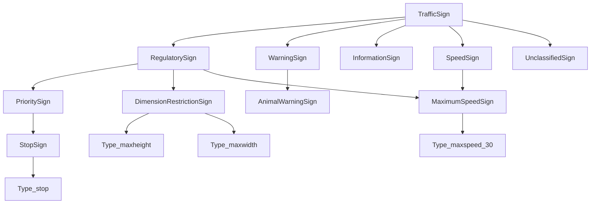

# Traffic-sign taxonomy and map-linked examples

This example classifies signs with the DLP reasoner, executes indexed geographic
queries and supplies independent distance references.
The ontology is runnable in **L0 with both Python and native relation backends**.
The versioned `.dlq` rules execute WGS84 points/distances and finite spatial scans.

```sh
.venv/bin/python examples/traffic_signs/generate.py --check
.venv/bin/python examples/traffic_signs/check.py --backend both
.venv/bin/python examples/traffic_signs/run_queries.py --backend both
```

The second command needs a C++17 compiler for the existing native backend's first
cached build. Use `--backend python` for the dependency-free reference path beyond
the repository's existing Python/RDFLib installation. No new dependencies, road
downloads, network requests, or provider installations are required.

`queries.dlq` combines inferred categories with candidate scans and exact
ellipsoidal refinement. `road-queries.dlq` uses an explicitly versioned directed
road provider and keeps unreachable outcomes observable. The production runtime
tests exercise all road fixture cases and node-move cache invalidation. See the
[implementation guide](../../docs/ENGINE_EXTENSION_IMPLEMENTATION.md) for APIs
and the distinction between this regional graph and a map-matching router.

## Retained source and explicit hierarchy

The byte-identical source snapshot is
[source/panoramax-road_signs_mapping.csv](source/panoramax-road_signs_mapping.csv).
It was copied read-only from
`/Users/raphaelvolz/Github/Woladen.de-analytics/deploy/prolix/class_maps/panoramax-road_signs_mapping.csv`
on 10 September 2026. Its 9,471 bytes have SHA-256
`a1e7ad5d7e2829d3214226fd9f20e3778c90f4b8f532d82ba933d4e61c1395e9`.
The CSV supplies YOLO/DE/FR/NL/CH/BE **crosswalk associations, not a hierarchy**.
Its national mappings are retained as supplied and are not independently verified
against national traffic law. The CSV contains no license declaration.

[curation.json](curation.json) explicitly assigns every one of the **224 distinct
YOLO labels** to a project-curated hierarchy of **41 categories**. These are
functional/visual groupings for this example, not official national legal
classifications. The generator matches exact labels; it does not derive category
relationships from prefixes or punctuation. Multiple parents are permitted, and
categories are not declared disjoint. For example:



Arrows point from superclass to subclass in this illustration. A previously
unseen label is assigned `UnclassifiedSign` by the ingestion helper until it is
reviewed. This fallback is explicit input classification, not closed-world
negation inside DLP. Unknown or incomplete national-code observations retain
`TrafficSign` without inventing a specific class.

[generate.py](generate.py) produces [taxonomy.dlp](taxonomy.dlp), the complete
[mapping.json](mapping.json) and [mapping-summary.json](mapping-summary.json),
plus the DLP rendering of the synthetic fixtures. The manifest retains **all 225
rows**, their CSV line numbers, exact cells, blanks and code token sequences.
The duplicated `pedestrian:start` label retains both rows and both Dutch codes.
The source spellings `Zone:30:end`, `hazard:include:down`, and `Fr:A8` remain exact.
There are no multi-code cells in this snapshot; the documented semicolon policy
preserves raw tokens and is checked with a synthetic multi-code cell. Empty cells
are missing mappings, not negative assertions. Generated identifier collisions
fail rather than overwriting classes.

To intentionally revise the snapshot, copy the new source explicitly, review
all changed labels/codes and `curation.json`, update the pinned source checksum,
then run `generate.py` and the checker. Ordinary regeneration reads only the
retained local snapshot. `--check` detects stale generated files without writing.

## National codes preserve ambiguity

The **720 national-code classes** require an observation of both the country
column and the exact code. For example, `observedCountry "DE"` together with
`observedNationalCode "DE:206"` infers `Code_DE_DE_206`, then `Type_stop`, then
`StopSign`. A missing country or `"DE"` paired with `"BE:C27"` does not match the
Belgian mapping. Recognition of `Type_stop` alone does not assert a German,
Swiss, or other national code.
The fixture records carry one country/code observation per sign. A production
ingestor must resolve observation context or reify multiple observations; it
must not flatten unrelated country/code pairs into unpaired multivalued fields.

An unambiguous crosswalk entry infers its one mapped YOLO type. A shared code
infers only the common ancestors of **all** its candidates in the curated
hierarchy; it never asserts every candidate as an intersection. The full candidate
list stays in the manifest. No `EquivalentClasses` axioms are emitted.

| Country and exact code | Preserved candidates | Safe inferred category |
| --- | --- | --- |
| BE, `BE:C27` | `maxheight`, `maxwidth` | `DimensionRestrictionSign` |
| BE, `BE:C23` | `no_hgv`, `no_u_turn` | `RegulatorySign` |
| BE, `BE:D1f` | `arrow_right`, `arrow_turn_right` | `DirectionalRequirementSign` |
| DE, `DE:315` | `parking:perpendicular`, `parking:sidewalk` | `ParkingSign` |
| FR, `FR:B21a2` | `arrow_left_down`, `arrow_right_down` | `DirectionalRequirementSign` |
| FR, `FR:B9i` | `no_car_trailer`, `no_trailer` | `VehicleRestrictionSign` |

These conclusions are relative to the supplied crosswalk and curation. Resolving
a source ambiguity requires better source evidence, not a stronger OWL axiom.

## Synthetic signs on OSM-shaped elements

[fixtures.json](fixtures.json) is the source of the generated
[fixtures.dlp](fixtures.dlp) and contains machine-readable expected classifications,
forbidden classifications, category queries, distances and route statuses. It
uses the shared [OSM schema](../osm/ontology.dlp):

- `sign:locatedAtNode` links a physical `TrafficSign` to an `osm:Node` with
  `osm:latitude`/`osm:longitude` decimal literals in WGS84 degrees.
- `sign:onRoadSegment` explicitly associates the sign with an `osm:RoadSegment`,
  which is an OSM `Way`, not necessarily one native routing edge.
- `osm:partOfRoad` associates ways with an `osm:RoadRoute` relation. Reified
  `WayNode` and `RelationMembership` facts preserve order and membership.

All entities use `https://example.org/traffic-sign/example#`; their negative
example `osmId` values are synthetic identifiers and are never asserted as
`osm.org` resources. The equatorial coordinates and country observations are
synthetic test values, not claims that German or Belgian signs exist there.
Sign attachment is explicitly provided, never inferred from geometric proximity.
These are hand-authored application fixtures using the shared schema, not output
or conformance examples for `examples/osm/map_snapshot.py`: that stricter current
snapshot mapper requires positive IDs and version metadata.

The checker composes three ordinary DLP graphs explicitly; no `owl:imports` or
undocumented include syntax is involved:

```python
from pathlib import Path
from rdflib import Graph, Namespace
from dlp_reasoner import Reasoner, parse_dlp

graph = Graph()
for name in ("examples/osm/ontology.dlp",
             "examples/traffic_signs/taxonomy.dlp",
             "examples/traffic_signs/fixtures.dlp"):
    graph += parse_dlp(Path(name).read_text(), source=name)
reasoner = Reasoner(graph, profile="L0", backend="native")
SIGN = Namespace("https://example.org/traffic-sign#")
print(reasoner.instances(SIGN.StopSign))  # stop_a and stop_b
```

## Distances and proposed rules

The default proposed `signDistance` is the **shortest WGS84 ellipsoidal surface
distance in metres**, with no altitude component. The reference fixtures use
short equatorial arcs, where the exact analytic expression is
`6378137 × abs(longitude difference in radians)`. The checker rejects other
latitudes and arcs over one degree instead of pretending to implement a general
inverse geodesic. A production provider must handle general coordinates with an
ellipsoidal inverse algorithm, such as the GeographicLib-backed library choices
in [the native domain report](../../docs/NATIVE_DOMAIN_LIBRARIES.md).

| Pair | Ellipsoidal distance | Supplied directed road distance |
| --- | ---: | ---: |
| `stop_a` → `stop_b` | 111.319490793 m | 140 m |
| `stop_b` → `stop_a` | 111.319490793 m | Unreachable |
| `stop_a` → `speed_30` | 222.638981587 m | 300 m |
| `speed_30` → `warning` | 0 m, distinct colocated signs | 0 m |
| `stop_a` → `access_ambiguous` | 1113.194907933 m | Unreachable |

`roadDistance` is a separate, directed provider operation with a pinned map,
vehicle/access profile, objective, time and matching policy. Here a tiny standard
library Dijkstra reference sums **supplied synthetic edge costs**. It does not
derive those costs from the shown way coordinates or exercise a routing library.
The disconnected island belongs to the same synthetic RoadRoute, demonstrating
that membership does not establish reachability. Provider failures, missing
coverage, and failed matching must remain distinct from a proved no-route result.
A distance along a fastest route is not a minimum possible road distance.

[queries.rules.proposed](queries.rules.proposed) sketches category-plus-distance
queries, exact distance checks after index candidate retrieval, explicit route
association and routing calls. It is deliberately not a `.dlp` file. A type/radius
match does not establish sign applicability to a vehicle: that additionally needs
directed road/lane association, orientation, valid time, vehicle conditions and
supplemental panels. Avoid materializing all sign pairs; bind requested pairs or
use category/spatial indexes to restrict candidates.

## Validation boundary

The checker runs **2,956 actual DLP checks per backend**, including every label
and national code, all ambiguous-code negative cases, fixture OSM associations,
and matching Python/native fixture types. It also runs **18 provenance checks**
and **27 separate distance/reference checks**. Its JSON explicitly reports
`dlp_builtins_executed: false`; no geographic, arithmetic or routing operation is
attributed to the current inference engine.
